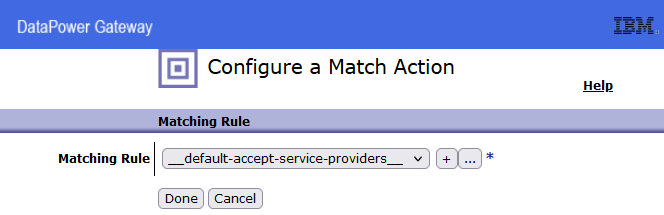

// Copyright (c) 2017, 2022 IBM Corporation and others.
// Licensed under Creative Commons Attribution-NoDerivatives
// 4.0 International (CC BY-ND 4.0)
// https://creativecommons.org/licenses/by-nd/4.0/
//
// Contributors:
//  Arnauld Desprets
:projectid: datapower-sec
:page-layout: guide-multipane
:page-duration: 8 hours
:page-description: Learn DataPower Security
:page-releasedate: 2023-01-31
:page-tags: ['DataPower Security']
:page-related-guides: ['rest-intro', 'containerize']
:page-guide-category: advanced
:page-essential: true
:page-essential-order: 4
:page-permalink: /docs/{projectid}
:common-includes: https://github.com/ADesprets/datapower-security/doc
:source-highlighter: prettify
:page-seo-title: DataPower Security
:page-seo-description: Learn DataPwer security TLS usage.
:guide-author: Arnauld Desprets

:linux: LINUX
:win: WINDOWS
:mac: MAC

:toc-title: Table of contents
:toc: left
:toclevels: 2

image::../images/idgX2.png[IDG X2,400,400,float="middle",align="center"]


:toc:
:url-gitlab: https://gitlab.eclipse.org

= IBM DataPower Security
This article is intended for an intermediate audience, not all the screens nor actions are specified. (Close window, save configuration, apply action are not documented)

== TLS
=== Initial configuration
We are going to use a very simple Multi-Protocol Gateway for the following tests. The service just returns what was sent. It can be XML, SOAP, JSON or any format. It has several Listeners (HTP or HTTPS)


We use an Application Domain named "Security". The MPGW named Test_TLS at the begining will only have one HTTP Handler. The logic is to use only one XSLT that will setup the skip-backside variable: `<dp:set-variable name="'var://service/mpgw/skip-backside'" value="'1'"/>`

Create an Application domain named Security.


Swith to Security application domain.


Create Multi-Protocol Gateway named Test_TLS.

> Notice that the creation of the dependent objects are in the order of the leaf first, the screen captures below do not reflect this order.


Create a Processing Policy Test_TLS_PP with a default name for the Procesing rule Test_TLS_PP_rule_0.
The processing rule contains a default Match action, an XSLT action that set up the skip-backside variable, and a default return.




Association of the XSLT to the XSLT Processing Action included in the Processing Rule


Create an HTTP Handler to listen to port 9086 (or any port available on the network interface, you can use Port Status to check available ports before starting the creation of the Multi Protocol Gateway).
Create HTTP Handler named HTTP9086.


To test the service, we can simply issue the following command:

Request:
```
curl http://dp105.fr.ibm:9086/ -d {"msg":"Hello"}
```
Response:
```
{msg:Hello}
```

> The generation of the chain of certificates is outside the scope of this article, please refer to https://github.com/ADesprets/TLS#script-to-create-a-chain-of-certificate-with-2-levels[Create a chain of certificates]

=== Chains of certificate used in this article


=== Server side TLS
In this chapter we create a *TLS Server Profile* and attach it to the *HTTPS Front Side Handler* attached to the *Multi-Procol Gateway*.
Below the object model for these objects.


Inside the Multi-Protocol Gateway, we create the following:
We create an HTTPS Handler named HTTPS9446


We choose Server Profile for the type of TLS profile.
We create a TLS Server Profile named 9446TLSP


We create an Identification Credential named 9446TLSIdCred


We create the Key


We create the Certificate with the same values since the P12 includes everything (Key, leaf and root certificates).


We create the Password Alias (a mechanism to manipulate securely passwords in DataPower) named 9446keysPM


We can now test the invocation. We use the cacert option to indicate the root certificate of the server to establish the trust relationship.

> It is important to consider which version of curl is used with openssl. In my case, the default windows curl would not work, this is an expected behavior, since curl has a strong dependancy with openssl or other cryptographic libraries.

Request:
```
curl --cacert server_root.crt https://dp105.fr.ibm:9446/ -d {"msg":"Hello"}

```
Response:
```
{msg:Hello}
```

=== Mutual TLS
In this chapter, we modify the *TLS Server Profile* and add a Validation Credential to establish the trust with the client root certificate, and we make the client authentication required.
Below the object model for these objects.


We change the TLS Server Profile to request Client authentication.


We create a Validation Credential named 9446ValCred


We add the root certificate of the client certificate, this is a crt, a "public certificate".
We create the Certificate named Client_Root_Cert


Request:
```
C:\bin\curl-7.79.1\bin\curl.exe -v --tlsv1.3 --cacert server_root.crt --cert client_leafwithchain.p12:secretout --cert-type P12  https://dp105.fr.ibm:9446/ -d {"msg":"Hello"}

```
Response:
```
{msg:Hello}
```

=== Mutual TLS with CRL

To start with, a few RFCs related to the CRL usage.

|===
| Name | Link | Domain | Title

| RFC 2527 | https://www.rfc-editor.org/rfc/rfc2527[here] | Internet X.509 Public Key Infrastructure | Certificate Policy and Certification Practices Framework
| RFC 3647 | https://www.rfc-editor.org/rfc/rfc3647[here] | Internet X.509 Public Key Infrastructure | Certificate Policy and Certification Practices Framework
| RFC 3280 | https://www.rfc-editor.org/rfc/rfc3280[here] | Internet X.509 Public Key Infrastructure | Certificate and Certificate Revocation List (CRL) Profile
| RFC 4630 | https://www.rfc-editor.org/rfc/rfc4630[here] | Update to DirectoryString Processing in the Internet X.509 Public Key Infrastructure | Certificate and Certificate Revocation List (CRL) Profile
| RFC 4630 | https://www.rfc-editor.org/rfc/rfc4325[here] | Internet X.509 Public Key Infrastructure Authority Information | Access Certificate Revocation List (CRL) Extension
|===

I'm using a local web server running with python with the following command: `py -m http.server 80`, you can make sure the web server is running with http://localhost/index.html.

To start with CRL Revocation check we need to configure the CRL Retrieval in the default domain and add CRL update policy.


We add a CRL update policy with the CRL Distribution endpoint.


In the Security domain, we can now change directly the Validation Credentials 9446ValCred and enforce the CRL revocation.


This will work because inside the client Certificate there is a CRL Ditribution endpoint which is the one configured in DataPower.

Request:
```
C:\bin\curl-7.79.1\bin\curl.exe -v --tlsv1.3 --cacert server_root.crt --cert client_leafwithchain.p12:secretout --cert-type P12  https://dp105.fr.ibm:9446/ -d {"msg":"Hello"}

```
Response:
```
{msg:Hello}
```

In the log we have the following mssage: `20230202T141124.539Z [0x8060010b][crypto][info] valcred(9446ValCred): tid(13984)[192.168.246.1]: certificate validation succeeded for '/C=FR/ST=Herault/L=Montpellier/O=IBM/OU=datapower/CN=testocsp client/emailAddress=admin@fr.ibm.com' against '9446ValCred'`

Stopping the web server containing the CRL gives this result

Response:
```
curl: (56) OpenSSL SSL_read: error:0A000418:SSL routines::tlsv1 alert unknown ca, errno 0
```


In the log we can see the following message:
`20230202T110831.627Z [0x81200026][ssl][error] ssl-server(9446TLSP): tid(7393)[192.168.246.1]: TLS handshake certificate validation error with validation credentials 9446ValCred: unable to get certificate CR`

To debug TLS, you can create a Log target with the following Event Subscriptions:


=== Mutual TLS with OCSP

=== Server side TLS with Client Certificate  in header with CRL
To implement this use case, instead of creating another Multi Protocol Gateway, I'm going to add a Policy rule and use a matching rule that is looking for a specific header named Test, and the value of this header must be 2. The order of this rule is before the rule that contains the match all action to take precedence.

Creation of the new Processing Rule inthe existing Processing Policy


Creation of the Match Action


Creation of the Matching Rule, when there is a Header called _Test_ with a value of _1_.


Editing the rule in the Matching Rule

image::../images/match-header-rule.png[Matching Rules Rule]


Request
```
C:\bin\curl-7.79.1\bin\curl.exe -v --tlsv1.3 --cacert server_root.crt --cert client_leafwithchain.p12:secretout --cert-type P12  https://dp105.fr.ibm:9446/ -H "Client-Cert: MIIFDTCCA/WgAwIBAgIUaqwM+TKr7VYeNasgVx3JyyORtu4wDQYJKoZIhvcNAQELBQAwgZcxCzAJBgNVBAYTAkZSMRAwDgYDVQQIEwdIZXJhdWx0MRQwEgYDVQQHEwtNb250cGVsbGllcjEMMAoGA1UEChMDSUJNMRIwEAYDVQQLEwlEYXRhUG93ZXIxHTAbBgNVBAMTFHRlc3RvY3NwIGNsaWVudCByb290MR8wHQYJKoZIhvcNAQkBFhBhZG1pbkBmci5pYm0uY29tMB4XDTIzMDEzMTEwMjAxM1oXDTI4MDEzMDEwMjAxM1owgZIxCzAJBgNVBAYTAkZSMRAwDgYDVQQIEwdIZXJhdWx0MRQwEgYDVQQHEwtNb250cGVsbGllcjEMMAoGA1UEChMDSUJNMRIwEAYDVQQLEwlkYXRhcG93ZXIxGDAWBgNVBAMTD3Rlc3RvY3NwIGNsaWVudDEfMB0GCSqGSIb3DQEJARYQYWRtaW5AZnIuaWJtLmNvbTCCASIwDQYJKoZIhvcNAQEBBQADggEPADCCAQoCggEBAPBtb8d4tV8txHYvNm8cguhlCR4Ki0+jDhFA8Xn3l0r0qmHmg11SUbd6dLGm9Q+Loo6jWg0RTltmQ2s8N1iAuGI+OePzUa5OlMucFxfJ8x8fzPYxgfZA18Sv005OHeI2rBNWCwr52xVserrtQmXVpko9fQ18J9SFbfml2U6FkM+e6fvDDxAw5RTbv3epbcdDRCH/6sSLUc4miiLt6U60LEWi8uT1Zgw17/mqshjgearGMGuhvP5NydQ8lzd9IoHNIkzNXF5/+LKR/igsjvw/+PalqSzFVZ4CqaO4rORJduoohs+JANQ0oYj2FR9G2dec02dlNQ4C/CAkOmHpUKbPA9ECAwEAAaOCAVIwggFOMAkGA1UdEwQCMAAwCwYDVR0PBAQDAgXgMB0GA1UdJQQWMBQGCCsGAQUFBwMBBggrBgEFBQcDAjAdBgNVHQ4EFgQUm93KEADngMp1ddAGmU+HpqcAmR8wHwYDVR0jBBgwFoAUe55jMuN1ZGJvRh4xyveK3Z5HsykwcQYIKwYBBQUHAQEEZTBjMGEGCCsGAQUFBzABhlVodHRwOi8vb2NzcC5teWR1bW15Y29tcGFueS5jb20vY2FJc3N1ZXJzO1VSSTpodHRwOi8vd3d3LmNhLm15ZHVtbXljb21wYW55LmNvbS9jYS5odG1sMDAGA1UdHwQpMCcwJaAjoCGGH2h0dHA6Ly9jcmwuc3dnZGVtby5jb20vcm9vdC5jcmwwMAYDVR0RBCkwJ4IVdGVzdG9jc3BjbGllbnQuZnIuaWJtgg50ZXN0b2NzcGNsaWVudDANBgkqhkiG9w0BAQsFAAOCAQEAiubvL8jQKC/Dc1n70FPbEmwH51WmiShgU8W6LOpYNYE7a+3xk9okWCHn1UUitfKze9S7KWRc09wDPAYmyoEx+pMsvKWVuzUMfCLcObIv303Bk+pvJ2BZXoMAuFEKHGpWdlFig/9pAvSIGqzcV8PuZFLw+gmpvBReDApOBz8pR3RPCHJzdKFb4kzOs8jko37YNr+eMNWuYqgHdvgHozIzBRTJ5s9iroBlCCDwjjIR0hEeFF8ehJK8MpC8YsnD9HBzLI1neCcwkdTOX6d4b9ne6PEPNMREIDuG9U1VaFqng5pD01MG+2yxeJ1AWfrUao8PtN0lw5mC5Ggvf0vICdGHDw==" -H "Test: 1" -d {"msg":"Hello"}  
```

The XSLT content
```
<xsl:stylesheet version="1.0" xmlns:xsl="http://www.w3.org/1999/XSL/Transform" xmlns:dp="http://www.datapower.com/extensions" extension-element-prefixes="dp">
	<xsl:template match="/">
		<dp:set-variable name="'var://service/mpgw/skip-backside'" value="'1'"/>
		<!-- Extract the certificate from the HTTP header -->
		<xsl:variable name="ClientCert" select="dp:http-request-header('Client-Cert')" />


		<xsl:variable name="input">
  		    <input>
    		    <subject>"concat('cert:',$ClientCert)"</subject>
  		    </input>
		</xsl:variable>
		<output>
  				<xsl:copy-of select="dp:validate-certificate($input,'9446ValCred')"/>
		</output>


		<!-- Get the DN of the certificate and add it to a Response HTTP header named ClientCertDN -->
		<xsl:variable name="ClientCertDN" select="dp:get-cert-subject(concat('cert:',$ClientCert))" />
		<dp:set-http-response-header name="'CertificateDN'" value="$ClientCertDN"/>
	</xsl:template>
</xsl:stylesheet>
```


=== Server side TLS with Client Certificate  in header with OCSP
